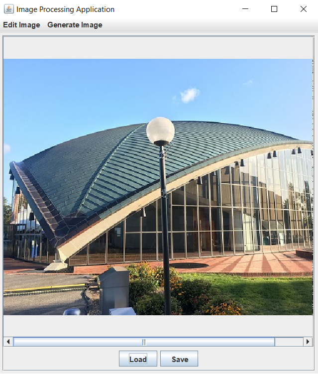
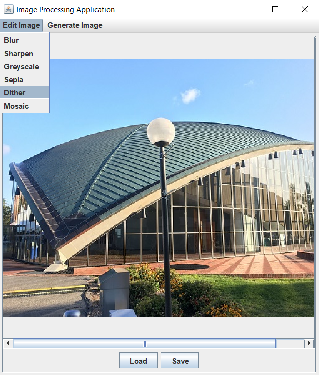
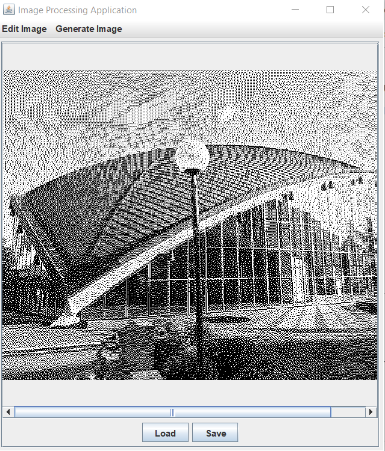
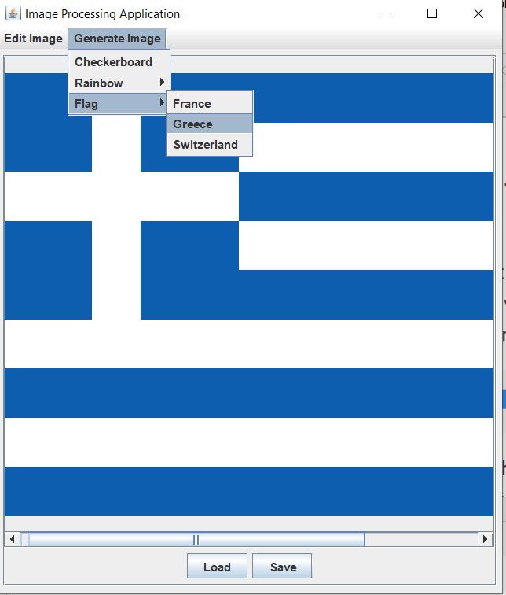

# Image Processing Application
This application was developed as a final project for the course work (CS 5010 - Programming Design
 Paradigm) at Northeastern University. The source code of this project is in restricted mode, as
  per instructor's guidelines to avoid one's code being misused. 
  
##### Note:  The code will be made available upon the request. Click [here](mailto:pooja.shanbhag1993@gmail.com?Subject=Request%20to%20access%20repo%20Image%20Processing%20Application)
  
This project aims at providing tools for image processing.

##### Image Editing operations:
1. Blurring the image.
2. Sharpening the image.
3. Transforming the image to Sepia tone.
4. Transforming the image to Greyscale tone.
5. Applying mosaic effect to the image.
6. Applying dithering effect to the image.

##### Ex: Dither Filter

After applying dither filter:

##### Image Generation operations:
1. Generate vertical/horizontal rainbow pattern image.
2. Generate checker board pattern image. 
3. Generate flag for supported countries(Supported countries: France, Greece and Switzerland).

##### Ex: Generating Greece flag

